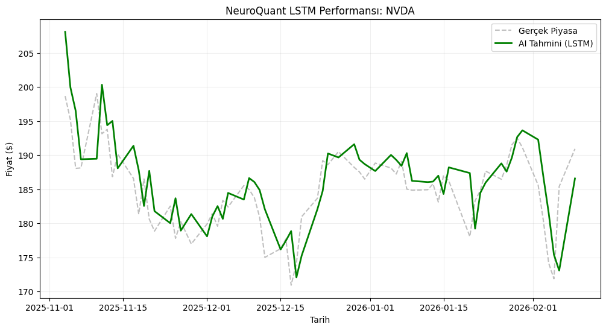

# 🧠 NeuroQuant: Honest AI Financial Forecasting

**NeuroQuant**, finansal piyasalardaki "duygusal kararları" minimize etmek ve matematiksel bir bakış açısı sunmak için geliştirilmiş, **Hibrit (Teknik + Temel)** bir yapay zeka asistanıdır.

🔗 **Canlı Demo:** https://neuroquant-s37f6vuhtauzpcqhf3kgfh.streamlit.app

---

## 🎯 Projenin Amacı ve Felsefesi

Çoğu finansal yapay zeka projesi, "zengin olma" vaadiyle sunulur. NeuroQuant'ın amacı bu değildir.
Amacımız: **Yatırımcının gözünden kaçan teknik desenleri ve binlerce haberi saniyeler içinde tarayıp, rasyonel bir "İkinci Görüş" sunmaktır.**

### 🚨 Neden Farklı? (The "No-Cheating" Policy)
Birçok borsa botu, eğitim sırasında gelecekteki verileri yanlışlıkla görerek (**Data Leakage**) "Mükemmel" sonuçlar üretir ama gerçek hayatta çuvallar.

NeuroQuant, **"Zaman Duvarı" (Time-Wall)** mimarisiyle eğitilmiştir:
* Model, eğitim sırasında 2026 verilerini ASLA görmemiştir.
* Backtest sonuçları, modelin *körlemesine* girdiği, hiç bilmediği bir piyasa simülasyonudur.
* Bu yüzden grafikler "kusursuz" değil, **"gerçekçi ve dürüsttür".**

---

## 📊 Performans (Backtest)

Aşağıdaki grafik, modelin hiç görmediği son 3 aylık piyasa verisindeki performansıdır. Model (Yeşil), piyasa trendlerini (Gri) önceden yakalamaya çalışır.

---

## 🧠 Teknik Özellikler

1.  **LSTM (Long Short-Term Memory):** Fiyatların sadece sayısal değerine değil, son 60 gündeki *hareket sırasına* bakar.
2.  **Universal Scaling:** Model tek bir hisseye (Overfitting) değil, "Yüzdesel Değişim" mantığına odaklanır. Böylece NVDA öğrendiği desenleri BTC üzerinde de uygulayabilir.
3.  **FinBERT Duygu Analizi:** Teknik analiz "AL" dese bile, piyasada "Kötü Haber" (Savaş, Kriz vb.) varsa yapay zeka işlemi **Veto Eder.**

### 📊 Gelişmiş Teknik Göstergeler
* **Bollinger Bantları & MACD:** Fiyatın oynaklığını ve trendin yönünü profesyonel seviyede takip edin.
* **Session State Hafızası:** Analizleriniz arasında geçiş yaparken verileriniz asla kaybolmaz, kesintisiz bir deneyim sunar.
* **Veri Export:** Yapılan tüm analizleri ve ham verileri tek tıkla CSV formatında indirebilirsiniz.

### 🤖 Gemini AI - Akıllı Finansal Yorumcu
Sadece grafik çizmekle kalmıyoruz; Google'ın en güncel **Gemini 3.0 Flash Preview** modelini kullanarak tüm teknik ve temel verileri bir potada eritiyoruz.
* **Teknik Füzyon:** RSI, MACD ve Bollinger bantlarından gelen sinyalleri insan diline çevirir.
* **Haber Analizi:** Piyasadaki haber akışını tarayarak riskleri ve fırsatları sentezler.
* **Kişiselleştirilmiş Özet:** "Neden AL?" veya "Neden SAT?" sorularına mantıklı, veriye dayalı cevaplar verir.

---

## ⚠️ YASAL UYARI (DISCLAIMER)

**Lütfen Dikkatle Okuyunuz:**

Bu proje, açık kaynak kodlu bir eğitim ve araştırma projesidir. Burada sunulan veriler, tahminler ve analizler **KESİNLİKLE YATIRIM TAVSİYESİ DEĞİLDİR.**

* Yapay zeka modelleri geçmiş verilere dayanır ve geleceği garanti edemez.
* Finansal piyasalar yüksek risk içerir; paranızın tamamını kaybedebilirsiniz.
* Bu aracı kullanarak aldığınız kararların sorumluluğu tamamen size aittir.

---
*Developed by Eren Osma

Not: Bu projenin geliştirme süreçlerinde kodlama asistanı olarak Yapay Zeka araçlarından faydalanılmıştır.
